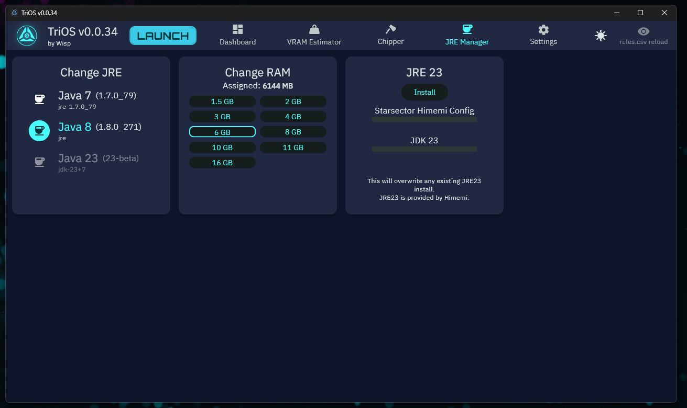

# TriOS
All-in-one Starsector toolkit. Very very early development.

## Tools

- **Launcher/Dashboard**: Replacement for the game launcher.
- (WIP) **VRAM Estimator**: Now with visualization.
- **Chipper**: Logfile viewer.
- (TODO) **StarModder**: Mod database viewer.
- **Rules.csv Autoreloader**: Hot reload for your mod rules.csv.
- (TODO) **Mod Manager**: SMOL 2.0.

## Screenshots

### Dashboard/Launcher

### Chipper

### JRE Manager

### rules.csv Autoreloader


## Building

You will need to run the following command in a terminal in the project's root folder (I run it in IntelliJ's terminal).

```
dart run build_runner watch --delete-conflicting-outputs
```

### Building libarchive
#### Windows
1. Download latest source: https://github.com/libarchive/libarchive/releases.
2. Download/install Visual Studio, add C/C++ support module stuff.
3. Download `vcpkg` and use it to install `libarchive`. https://vcpkg.io/en/getting-started
4. Add the following to CMakeLists.txt before the first PROJECT() call:
```
set(CMAKE_TOOLCHAIN_FILE "${CMAKE_CURRENT_SOURCE_DIR}/vcpkg/scripts/buildsystems/vcpkg.cmake"
  CACHE STRING "Vcpkg toolchain file")
```
5. Download and install CMake for Windows. https://cmake.org/download/
6. symlink the `vcpkg` folder into the  `libarchive` folder, or just move it there.
7. Run the CMake GUI, set output to `libarchive/build`, hit Configure, wait, hit Generate, then open in Visual Studio.
8. In VS, pick a Release Configuration and Run. It'll appear in `build/bin`. `MinSizeRel` seems good.
