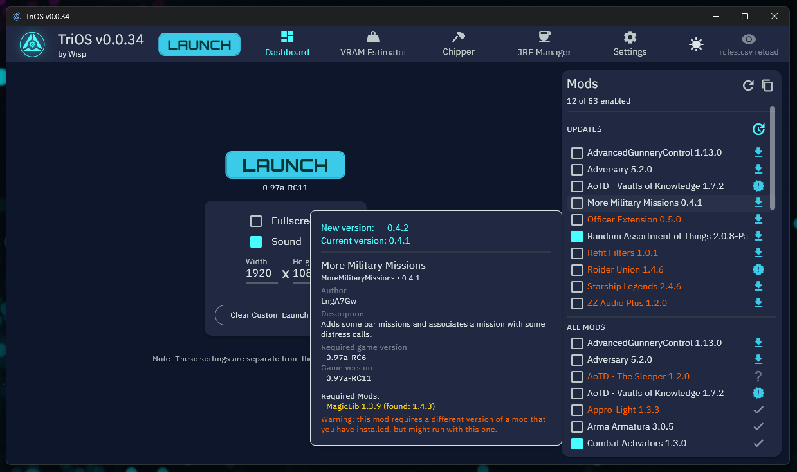

# TriOS
All-in-one Starsector toolkit. Very very early development.

## Tools

- **Launcher/Dashboard**: Replacement for the game launcher.
- (WIP) **VRAM Estimator**: Now with visualization.
- **Chipper**: Logfile viewer.
- (TODO) **StarModder**: Mod database viewer.
- **Rules.csv Autoreloader**: Hot reload for your mod rules.csv.
- (TODO) **Mod Manager**: SMOL 2.0.

## Screenshots

### Dashboard/Launcher

### Chipper

### JRE Manager

### rules.csv Autoreloader


## Building

You will need to run the following command in a terminal in the project's root folder (I run it in IntelliJ's terminal).

```
dart run build_runner watch --delete-conflicting-outputs
```

### Building libarchive
#### Windows
1. Download latest source: https://github.com/libarchive/libarchive/releases.
1. Download/install Visual Studio, add C/C++ support module stuff.
1. Download `vcpkg`. https://vcpkg.io/en/getting-started
1. Symlink the `vcpkg` folder into the  `libarchive` folder, or just move it there.
1. Use vcpkg to install libarchive: `./vcpkg/vcpkg.exe install libarchive:x64-windows`.
1. Add the following to CMakeLists.txt before the first PROJECT() call:
    ```
    set(CMAKE_TOOLCHAIN_FILE "${CMAKE_CURRENT_SOURCE_DIR}/vcpkg/scripts/buildsystems/vcpkg.cmake"
      CACHE STRING "Vcpkg toolchain file")
    ```
1. Download and install CMake for Windows. https://cmake.org/download/
1. Run the CMake GUI, set output to `libarchive/build`, hit `Configure`, wait, hit `Generate`, then click `Open Project`.
1. In VS, pick a Release Configuration and Run. It'll appear in `build/bin`. `MinSizeRel` seems good.

#### MacOS
1. Install deps: 
   ```
   brew install autoconf automake libtool pkg-config bzip2 xz lz4 zlib zstd
   ```
1. Tell it where to find xz (use `whereis xz` to make sure the paths are right):
   ```
   export LDFLAGS="-L/opt/homebrew/opt/xz/lib -L/opt/homebrew/opt/zlib/lib -L/opt/homebrew/opt/lz4/lib -L/opt/homebrew/opt/zstd/lib"
   export CPPFLAGS="-I/opt/homebrew/opt/xz/include -I/opt/homebrew/opt/zlib/include -I/opt/homebrew/opt/lz4/include -I/opt/homebrew/opt/zstd/include"
   export PKG_CONFIG_PATH="/opt/homebrew/opt/xz/lib/pkgconfig:/opt/homebrew/opt/zlib/lib/pkgconfig:/opt/homebrew/opt/lz4/lib/pkgconfig:/opt/homebrew/opt/zstd/lib/pkgconfig"
   ```
1. Check out source:
   ```
   git clone https://github.com/libarchive/libarchive.git
   cd libarchive
   ```
1. Build:
   ```
   ./build/autogen.sh
   ./configure --prefix=$HOME/libarchive-output --with-bz2lib --with-lzma --with-lz4 --with-zlib --with-zstd
   make
   make install
   ```
   The output will be in `$HOME/libarchive-output`.

#### Linux
1. Install deps:
   ```
   TODO copy/paste here
   ```
1. Check out source:
   ```
   git clone https://github.com/libarchive/libarchive.git
   cd libarchive
   ```
1. Build for x86-64 (assuming you're on this):
   ```
   ./build/autogen.sh
   ./configure --prefix=$HOME/libarchive-output-x86-64 --with-bz2lib --with-lzma --with-lz4 --with-zlib --with-zstd
   make
   make install
   ```
   The output will be in `$HOME/libarchive-output-x86-64`. x84-64 covers just about all desktop PCs and laptops. And the Steam Deck.